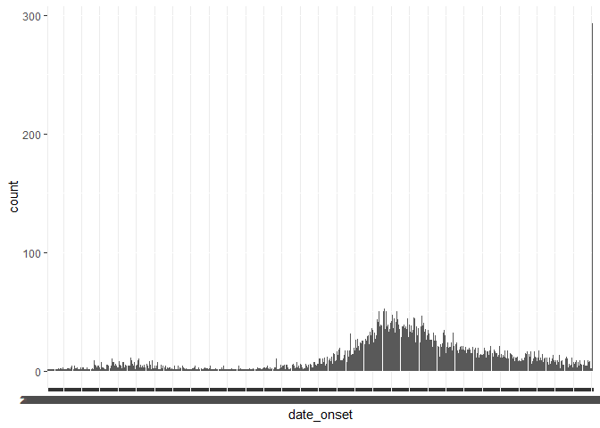

Data Cleaning
================

``` r
pacman::p_load(
        rio,        # importing data  
        here,       # relative file pathways  
        janitor,    # data cleaning and tables
        lubridate,  # working with dates
        matchmaker, # dictionary-based cleaning
        epikit,     # age_categories() function
        tidyverse   # data management and visualization
)
```

### Import data

``` r
data_raw <- rio::import(here("data/linelist_raw.xlsx"))
```

    ## New names:
    ## • `` -> `...28`

``` r
data_raw %>% head()
```

    ##   case_id generation infection date date onset  hosp date date_of_outcome outcome gender
    ## 1  5fe599          4     2014-05-08 2014-05-13 2014-05-15            <NA>    <NA>      m
    ## 2  8689b7          4           <NA> 2014-05-13 2014-05-14      2014-05-18 Recover      f
    ## 3  11f8ea          2           <NA> 2014-05-16 2014-05-18      2014-05-30 Recover      m
    ## 4  b8812a          3     2014-05-04 2014-05-18 2014-05-20            <NA>    <NA>      f
    ## 5  893f25          3     2014-05-18 2014-05-21 2014-05-22      2014-05-29 Recover      m
    ## 6  be99c8          3     2014-05-03 2014-05-22 2014-05-23      2014-05-24 Recover      f
    ##                               hospital       lon      lat infector source age age_unit row_num wt_kg ht_cm
    ## 1                                Other -13.21574 8.468973   f547d6  other   2    years       1    27    48
    ## 2                                 <NA> -13.21523 8.451719     <NA>   <NA>   3    years       2    25    59
    ## 3 St. Mark's Maternity Hospital (SMMH) -13.21291 8.464817     <NA>   <NA>  56    years       3    91   238
    ## 4                        Port Hospital -13.23637 8.475476   f90f5f  other  18    years       4    41   135
    ## 5                    Military Hospital -13.22286 8.460824   11f8ea  other   3    years       5    36    71
    ## 6                        Port Hospital -13.22263 8.461831   aec8ec  other  16    years       6    56   116
    ##   ct_blood fever chills cough aches vomit temp time_admission merged_header ...28
    ## 1       22    no     no   yes    no   yes 36.8           <NA>             a     b
    ## 2       22  <NA>   <NA>  <NA>  <NA>  <NA> 36.9          09:36             a     b
    ## 3       21  <NA>   <NA>  <NA>  <NA>  <NA> 36.9          16:48             a     b
    ## 4       23    no     no    no    no    no 36.8          11:22             a     b
    ## 5       23    no     no   yes    no   yes 36.9          12:60             a     b
    ## 6       21    no     no   yes    no   yes 37.6          14:13             a     b

### Check data

``` r
skimr::skim(data_raw)
```

|                                                  |          |
|:-------------------------------------------------|:---------|
| Name                                             | data_raw |
| Number of rows                                   | 6611     |
| Number of columns                                | 28       |
| \_\_\_\_\_\_\_\_\_\_\_\_\_\_\_\_\_\_\_\_\_\_\_   |          |
| Column type frequency:                           |          |
| character                                        | 17       |
| numeric                                          | 8        |
| POSIXct                                          | 3        |
| \_\_\_\_\_\_\_\_\_\_\_\_\_\_\_\_\_\_\_\_\_\_\_\_ |          |
| Group variables                                  | None     |

Data summary

**Variable type: character**

| skim_variable  | n_missing | complete_rate | min | max | empty | n_unique | whitespace |
|:---------------|----------:|--------------:|----:|----:|------:|---------:|-----------:|
| case_id        |       137 |          0.98 |   6 |   6 |     0 |     5888 |          0 |
| date onset     |       293 |          0.96 |  10 |  10 |     0 |      580 |          0 |
| outcome        |      1500 |          0.77 |   5 |   7 |     0 |        2 |          0 |
| gender         |       324 |          0.95 |   1 |   1 |     0 |        2 |          0 |
| hospital       |      1512 |          0.77 |   5 |  36 |     0 |       13 |          0 |
| infector       |      2323 |          0.65 |   6 |   6 |     0 |     2697 |          0 |
| source         |      2323 |          0.65 |   5 |   7 |     0 |        2 |          0 |
| age            |       107 |          0.98 |   1 |   2 |     0 |       75 |          0 |
| age_unit       |         7 |          1.00 |   5 |   6 |     0 |        2 |          0 |
| fever          |       258 |          0.96 |   2 |   3 |     0 |        2 |          0 |
| chills         |       258 |          0.96 |   2 |   3 |     0 |        2 |          0 |
| cough          |       258 |          0.96 |   2 |   3 |     0 |        2 |          0 |
| aches          |       258 |          0.96 |   2 |   3 |     0 |        2 |          0 |
| vomit          |       258 |          0.96 |   2 |   3 |     0 |        2 |          0 |
| time_admission |       844 |          0.87 |   5 |   5 |     0 |     1091 |          0 |
| merged_header  |         0 |          1.00 |   1 |   1 |     0 |        1 |          0 |
| …28            |         0 |          1.00 |   1 |   1 |     0 |        1 |          0 |

**Variable type: numeric**

| skim_variable | n_missing | complete_rate |    mean |      sd |     p0 |     p25 |     p50 |     p75 |    p100 | hist  |
|:--------------|----------:|--------------:|--------:|--------:|-------:|--------:|--------:|--------:|--------:|:------|
| generation    |         7 |          1.00 |   16.60 |    5.71 |   0.00 |   13.00 |   16.00 |   20.00 |   37.00 | ▁▆▇▂▁ |
| lon           |         7 |          1.00 |  -13.23 |    0.02 | -13.27 |  -13.25 |  -13.23 |  -13.22 |  -13.21 | ▅▃▃▅▇ |
| lat           |         7 |          1.00 |    8.47 |    0.01 |   8.45 |    8.46 |    8.47 |    8.48 |    8.49 | ▅▇▇▇▆ |
| row_num       |         0 |          1.00 | 3240.91 | 1857.83 |   1.00 | 1647.50 | 3241.00 | 4836.50 | 6481.00 | ▇▇▇▇▇ |
| wt_kg         |         7 |          1.00 |   52.69 |   18.59 | -11.00 |   41.00 |   54.00 |   66.00 |  111.00 | ▁▃▇▅▁ |
| ht_cm         |         7 |          1.00 |  125.25 |   49.57 |   4.00 |   91.00 |  130.00 |  159.00 |  295.00 | ▂▅▇▂▁ |
| ct_blood      |         7 |          1.00 |   21.26 |    1.67 |  16.00 |   20.00 |   22.00 |   22.00 |   26.00 | ▁▃▇▃▁ |
| temp          |       158 |          0.98 |   38.60 |    0.95 |  35.20 |   38.30 |   38.80 |   39.20 |   40.80 | ▁▂▂▇▁ |

**Variable type: POSIXct**

| skim_variable   | n_missing | complete_rate | min        | max        | median     | n_unique |
|:----------------|----------:|--------------:|:-----------|:-----------|:-----------|---------:|
| infection date  |      2322 |          0.65 | 2012-04-09 | 2015-04-27 | 2014-10-04 |      538 |
| hosp date       |         7 |          1.00 | 2012-04-20 | 2015-04-30 | 2014-10-15 |      570 |
| date_of_outcome |      1068 |          0.84 | 2012-05-14 | 2015-06-04 | 2014-10-26 |      575 |

### Clean column names

``` r
# check column names
data_raw %>% names()
```

    ##  [1] "case_id"         "generation"      "infection date"  "date onset"      "hosp date"       "date_of_outcome"
    ##  [7] "outcome"         "gender"          "hospital"        "lon"             "lat"             "infector"       
    ## [13] "source"          "age"             "age_unit"        "row_num"         "wt_kg"           "ht_cm"          
    ## [19] "ct_blood"        "fever"           "chills"          "cough"           "aches"           "vomit"          
    ## [25] "temp"            "time_admission"  "merged_header"   "...28"

``` r
# clean column names automatically
data_raw %>% 
        janitor::clean_names() %>% 
        names()
```

    ##  [1] "case_id"         "generation"      "infection_date"  "date_onset"      "hosp_date"       "date_of_outcome"
    ##  [7] "outcome"         "gender"          "hospital"        "lon"             "lat"             "infector"       
    ## [13] "source"          "age"             "age_unit"        "row_num"         "wt_kg"           "ht_cm"          
    ## [19] "ct_blood"        "fever"           "chills"          "cough"           "aches"           "vomit"          
    ## [25] "temp"            "time_admission"  "merged_header"   "x28"

``` r
# rename columns manually using `janitor::clean_names()`
data_raw %>% 
        janitor::clean_names(replace = c(onset = "date_of_onset")) %>% 
        names()
```

    ##  [1] "case_id"            "generation"         "infection_date"     "date_date_of_onset" "hosp_date"         
    ##  [6] "date_of_outcome"    "outcome"            "gender"             "hospital"           "lon"               
    ## [11] "lat"                "infector"           "source"             "age"                "age_unit"          
    ## [16] "row_num"            "wt_kg"              "ht_cm"              "ct_blood"           "fever"             
    ## [21] "chills"             "cough"              "aches"              "vomit"              "temp"              
    ## [26] "time_admission"     "merged_header"      "x28"

``` r
# rename columns manually using `dplyr::rename()`
data <- data_raw %>% 
        janitor::clean_names() %>% 
        dplyr::rename(# new column = old column
                      date_infection = infection_date,
                      date_hospitalisation = hosp_date,
                      date_outcome = date_of_outcome) 
data %>% names()
```

    ##  [1] "case_id"              "generation"           "date_infection"       "date_onset"          
    ##  [5] "date_hospitalisation" "date_outcome"         "outcome"              "gender"              
    ##  [9] "hospital"             "lon"                  "lat"                  "infector"            
    ## [13] "source"               "age"                  "age_unit"             "row_num"             
    ## [17] "wt_kg"                "ht_cm"                "ct_blood"             "fever"               
    ## [21] "chills"               "cough"                "aches"                "vomit"               
    ## [25] "temp"                 "time_admission"       "merged_header"        "x28"

### `tidyselect` helper functions

`where()`

``` r
# select Numeric columns
data %>% 
        select(where(is.numeric)) %>% 
        names()
```

    ## [1] "generation" "lon"        "lat"        "row_num"    "wt_kg"      "ht_cm"      "ct_blood"   "temp"

`matches()`

``` r
data %>%
        select(matches("onset|hosp|fev")) %>%
        names()
```

    ## [1] "date_onset"           "date_hospitalisation" "hospital"             "fever"

`any_of()`

``` r
data %>%
        select(any_of(c("date_onset",
                        "month_onset",
                        "year_onset",
                        "fever"))) %>%
        names()
```

    ## [1] "date_onset" "fever"

### Remove columns

``` r
data %>%
        select(-c(row_num, merged_header, x28)) %>% 
        names()
```

    ##  [1] "case_id"              "generation"           "date_infection"       "date_onset"          
    ##  [5] "date_hospitalisation" "date_outcome"         "outcome"              "gender"              
    ##  [9] "hospital"             "lon"                  "lat"                  "infector"            
    ## [13] "source"               "age"                  "age_unit"             "wt_kg"               
    ## [17] "ht_cm"                "ct_blood"             "fever"                "chills"              
    ## [21] "cough"                "aches"                "vomit"                "temp"                
    ## [25] "time_admission"

### De-duplication

``` r
data_raw %>% nrow()
```

    ## [1] 6611

``` r
data %>% distinct() %>% nrow()
```

    ## [1] 6609

### Transform data

`coalesce()` Find the first non-missing value at each position?
Cumulative math

``` r
# simple example
cumsum(c(2, 5, 10, 15))
```

    ## [1]  2  7 17 32

Calculate the cumulative number of cases per day in an outbreak

``` r
data %>%
        # count of rows per day, as column 'n'
        count(date_onset) %>%
        # new column, of the cumulative sum at each row
        mutate(cumulative_cases = cumsum(n)) %>%
        tail(n = 15)
```

    ##     date_onset   n cumulative_cases
    ## 567 2015-04-17   4             6244
    ## 568 2015-04-18   9             6253
    ## 569 2015-04-19   6             6259
    ## 570 2015-04-20   5             6264
    ## 571 2015-04-21   5             6269
    ## 572 2015-04-22   9             6278
    ## 573 2015-04-23   4             6282
    ## 574 2015-04-24   4             6286
    ## 575 2015-04-25   4             6290
    ## 576 2015-04-26   9             6299
    ## 577 2015-04-27   7             6306
    ## 578 2015-04-28   8             6314
    ## 579 2015-04-29   2             6316
    ## 580 2015-04-30   2             6318
    ## 581       <NA> 293             6611

``` r
# cumsum(), cummean(), cummin(), cummax(), cumany(), cumall()
```

### Recode values

#### Specific values

Fix incorrect value manually

``` r
data %>% 
        select(date_onset) %>%
        mutate(new_date_onset = recode(date_onset,
                                       # old value = new value
                                       "2014-05-16" = "2024-05-16")) %>% 
        head(4)
```

    ##   date_onset new_date_onset
    ## 1 2014-05-13     2014-05-13
    ## 2 2014-05-13     2014-05-13
    ## 3 2014-05-16     2024-05-16
    ## 4 2014-05-18     2014-05-18

``` r
# re-coding multiple values within one column.
# check "hospital" column --> several different spellings + many missing values
data %>% count(hospital)
```

    ##                                hospital    n
    ## 1                       Central Hopital   11
    ## 2                      Central Hospital  457
    ## 3                            Hospital A  290
    ## 4                            Hospital B  290
    ## 5                      Military Hopital   32
    ## 6                     Military Hospital  800
    ## 7                      Mitylira Hopital    1
    ## 8                     Mitylira Hospital   79
    ## 9                                 Other  907
    ## 10                         Port Hopital   48
    ## 11                        Port Hospital 1756
    ## 12 St. Mark's Maternity Hospital (SMMH)  417
    ## 13   St. Marks Maternity Hopital (SMMH)   11
    ## 14                                 <NA> 1512

``` r
# re-code values
data %>%
        mutate(hospital = recode(hospital,
                                 # old value = new value
                                 "Mitylira Hopital"  = "Military Hospital",
                                 "Mitylira Hospital" = "Military Hospital",
                                 "Military Hopital"  = "Military Hospital",
                                 "Port Hopital"      = "Port Hospital",
                                 "Central Hopital"   = "Central Hospital",
                                 "other"             = "Other",
                                 "St. Marks Maternity Hopital (SMMH)" = "St. Mark's Maternity Hospital (SMMH)")) %>%
        count(hospital)
```

    ##                               hospital    n
    ## 1                     Central Hospital  468
    ## 2                           Hospital A  290
    ## 3                           Hospital B  290
    ## 4                    Military Hospital  912
    ## 5                                Other  907
    ## 6                        Port Hospital 1804
    ## 7 St. Mark's Maternity Hospital (SMMH)  428
    ## 8                                 <NA> 1512

#### Re-code value by logic

`replace()`

``` r
# change gender of one specific observation to "Female" 
data %>% select(case_id:date_onset, gender) %>%
        filter(date_onset == "2014-05-16")
```

    ##   case_id generation date_infection date_onset gender
    ## 1  11f8ea          2           <NA> 2014-05-16      m
    ## 2  76b97a          2     2014-05-11 2014-05-16      m

``` r
data %>% select(case_id:date_onset,
                gender) %>%
        filter(date_onset == "2014-05-16") %>%
        mutate(gender = replace(gender,
                                date_onset == "2014-05-16",
                                "Female"))
```

    ##   case_id generation date_infection date_onset gender
    ## 1  11f8ea          2           <NA> 2014-05-16 Female
    ## 2  76b97a          2     2014-05-11 2014-05-16 Female

`ifelse()` and `if_else()`

``` r
data %>% count(source)
```

    ##    source    n
    ## 1 funeral  629
    ## 2   other 3659
    ## 3    <NA> 2323

``` r
data %>% select(source) %>% head(10)
```

    ##    source
    ## 1   other
    ## 2    <NA>
    ## 3    <NA>
    ## 4   other
    ## 5   other
    ## 6   other
    ## 7   other
    ## 8   other
    ## 9    <NA>
    ## 10   <NA>

``` r
data %>% mutate(source_known = if_else(!is.na(source),
                                       "known",
                                       "unknown")) %>%
        select(source, source_known) %>%
        head(10)
```

    ##    source source_known
    ## 1   other        known
    ## 2    <NA>      unknown
    ## 3    <NA>      unknown
    ## 4   other        known
    ## 5   other        known
    ## 6   other        known
    ## 7   other        known
    ## 8   other        known
    ## 9    <NA>      unknown
    ## 10   <NA>      unknown

``` r
data %>% select(outcome, date_outcome) %>%
        tail()
```

    ##      outcome date_outcome
    ## 6606   Death   2015-01-27
    ## 6607   Death   2014-08-29
    ## 6608   Death   2014-09-19
    ## 6609 Recover   2015-02-18
    ## 6610 Recover   2014-11-04
    ## 6611 Recover   2015-04-22

``` r
data %>% select(outcome, date_outcome) %>%
        mutate(date_death = if_else(outcome == "Death",
                                    date_outcome,
                                    NA)) %>%
        tail()
```

    ##      outcome date_outcome date_death
    ## 6606   Death   2015-01-27 2015-01-27
    ## 6607   Death   2014-08-29 2014-08-29
    ## 6608   Death   2014-09-19 2014-09-19
    ## 6609 Recover   2015-02-18       <NA>
    ## 6610 Recover   2014-11-04       <NA>
    ## 6611 Recover   2015-04-22       <NA>

`case_when()`

``` r
data %>% 
        mutate(age = as.numeric(age),
               age_years = case_when(# if age unit is years
                                     age_unit == "years"  ~ age,
                                     # if age unit is months, divide age by 12
                                     age_unit == "months" ~ age/12,
                                     # if age unit is missing, assume years
                                     # any other circumstance, assign NA (missing)
                                     is.na(age_unit)      ~ age)) %>%
        select(age, age_unit, age_years) %>% 
        tail(10)
```

    ##      age age_unit age_years
    ## 6602  12    years      12.0
    ## 6603  23    years      23.0
    ## 6604   3    years       3.0
    ## 6605   8    years       8.0
    ## 6606  14    years      14.0
    ## 6607   3    years       3.0
    ## 6608   8    years       8.0
    ## 6609  24    years      24.0
    ## 6610   2    years       2.0
    ## 6611   6   months       0.5

``` r
data %>% 
        mutate(case_status = case_when(
                
                # if patient had lab test and it is positive,
                # then they are marked as a confirmed case 
                ct_blood < 20                   ~ "Confirmed",
                
                # given that a patient does not have a positive lab result,
                # if patient has a "source" (epidemiological link) AND has fever, 
                # then they are marked as a suspect case
                !is.na(source) & fever == "yes" ~ "Suspect",
                
                # any other patient not addressed above 
                # is marked for follow up
                TRUE                            ~ "To investigate")) %>%
        select(ct_blood, source, fever, case_status) %>%
        tail(15)
```

    ##      ct_blood source fever    case_status
    ## 6597       23  other   yes        Suspect
    ## 6598       22  other   yes        Suspect
    ## 6599       19   <NA>   yes      Confirmed
    ## 6600       21   <NA>   yes To investigate
    ## 6601       20  other   yes        Suspect
    ## 6602       24  other   yes        Suspect
    ## 6603       24   <NA>   yes To investigate
    ## 6604       25  other   yes        Suspect
    ## 6605       19  other   yes      Confirmed
    ## 6606       22   <NA>   yes To investigate
    ## 6607       23  other   yes        Suspect
    ## 6608       22   <NA>   yes To investigate
    ## 6609       23  other   yes        Suspect
    ## 6610       22  other   yes        Suspect
    ## 6611       21  other   yes        Suspect

#### Work with missing value

``` r
data %>% count(hospital)
```

    ##                                hospital    n
    ## 1                       Central Hopital   11
    ## 2                      Central Hospital  457
    ## 3                            Hospital A  290
    ## 4                            Hospital B  290
    ## 5                      Military Hopital   32
    ## 6                     Military Hospital  800
    ## 7                      Mitylira Hopital    1
    ## 8                     Mitylira Hospital   79
    ## 9                                 Other  907
    ## 10                         Port Hopital   48
    ## 11                        Port Hospital 1756
    ## 12 St. Mark's Maternity Hospital (SMMH)  417
    ## 13   St. Marks Maternity Hopital (SMMH)   11
    ## 14                                 <NA> 1512

`replace_na()`

``` r
data %>% 
        mutate(hospital = replace_na(hospital, "Missing")) %>%
        count(hospital)
```

    ##                                hospital    n
    ## 1                       Central Hopital   11
    ## 2                      Central Hospital  457
    ## 3                            Hospital A  290
    ## 4                            Hospital B  290
    ## 5                      Military Hopital   32
    ## 6                     Military Hospital  800
    ## 7                               Missing 1512
    ## 8                      Mitylira Hopital    1
    ## 9                     Mitylira Hospital   79
    ## 10                                Other  907
    ## 11                         Port Hopital   48
    ## 12                        Port Hospital 1756
    ## 13 St. Mark's Maternity Hospital (SMMH)  417
    ## 14   St. Marks Maternity Hopital (SMMH)   11

`fct_explicit_na()` replace NA values of `factor` data class

``` r
data %>% 
        mutate(hospital = fct_explicit_na(hospital)) %>%
        count(hospital)
```

    ## Warning: There was 1 warning in `mutate()`.
    ## ℹ In argument: `hospital = fct_explicit_na(hospital)`.
    ## Caused by warning:
    ## ! `fct_explicit_na()` was deprecated in forcats 1.0.0.
    ## ℹ Please use `fct_na_value_to_level()` instead.

    ##                                hospital    n
    ## 1                       Central Hopital   11
    ## 2                      Central Hospital  457
    ## 3                            Hospital A  290
    ## 4                            Hospital B  290
    ## 5                      Military Hopital   32
    ## 6                     Military Hospital  800
    ## 7                      Mitylira Hopital    1
    ## 8                     Mitylira Hospital   79
    ## 9                                 Other  907
    ## 10                         Port Hopital   48
    ## 11                        Port Hospital 1756
    ## 12 St. Mark's Maternity Hospital (SMMH)  417
    ## 13   St. Marks Maternity Hopital (SMMH)   11
    ## 14                            (Missing) 1512

`na_if()`

``` r
data %>% 
        mutate(hospital = na_if(hospital, "Other")) %>%
        count(hospital)
```

    ##                                hospital    n
    ## 1                       Central Hopital   11
    ## 2                      Central Hospital  457
    ## 3                            Hospital A  290
    ## 4                            Hospital B  290
    ## 5                      Military Hopital   32
    ## 6                     Military Hospital  800
    ## 7                      Mitylira Hopital    1
    ## 8                     Mitylira Hospital   79
    ## 9                          Port Hopital   48
    ## 10                        Port Hospital 1756
    ## 11 St. Mark's Maternity Hospital (SMMH)  417
    ## 12   St. Marks Maternity Hopital (SMMH)   11
    ## 13                                 <NA> 2419

Test

``` r
# convert temperatures above 40 to NA
data %>% count(temp)
```

    ##    temp   n
    ## 1  35.2   1
    ## 2  35.3   1
    ## 3  35.5   2
    ## 4  35.6   3
    ## 5  35.7   1
    ## 6  35.8   5
    ## 7  35.9  14
    ## 8  36.0  11
    ## 9  36.1  23
    ## 10 36.2  32
    ## 11 36.3  41
    ## 12 36.4  65
    ## 13 36.5  74
    ## 14 36.6  75
    ## 15 36.7  77
    ## 16 36.8  86
    ## 17 36.9 112
    ## 18 37.0 109
    ## 19 37.1 100
    ## 20 37.2  95
    ## 21 37.3  92
    ## 22 37.4  83
    ## 23 37.5  75
    ## 24 37.6  60
    ## 25 37.7  30
    ## 26 37.8  30
    ## 27 37.9  30
    ## 28 38.0  34
    ## 29 38.1 105
    ## 30 38.2 128
    ## 31 38.3 156
    ## 32 38.4 191
    ## 33 38.5 250
    ## 34 38.6 309
    ## 35 38.7 353
    ## 36 38.8 393
    ## 37 38.9 398
    ## 38 39.0 390
    ## 39 39.1 419
    ## 40 39.2 402
    ## 41 39.3 361
    ## 42 39.4 314
    ## 43 39.5 254
    ## 44 39.6 201
    ## 45 39.7 161
    ## 46 39.8  88
    ## 47 39.9  64
    ## 48 40.0  57
    ## 49 40.1  41
    ## 50 40.2  19
    ## 51 40.3  15
    ## 52 40.4  10
    ## 53 40.5   7
    ## 54 40.6   4
    ## 55 40.7   1
    ## 56 40.8   1
    ## 57   NA 158

``` r
data %>% 
        mutate(new_temp = replace(temp, temp > 40, NA)) %>%
        count(new_temp)
```

    ##    new_temp   n
    ## 1      35.2   1
    ## 2      35.3   1
    ## 3      35.5   2
    ## 4      35.6   3
    ## 5      35.7   1
    ## 6      35.8   5
    ## 7      35.9  14
    ## 8      36.0  11
    ## 9      36.1  23
    ## 10     36.2  32
    ## 11     36.3  41
    ## 12     36.4  65
    ## 13     36.5  74
    ## 14     36.6  75
    ## 15     36.7  77
    ## 16     36.8  86
    ## 17     36.9 112
    ## 18     37.0 109
    ## 19     37.1 100
    ## 20     37.2  95
    ## 21     37.3  92
    ## 22     37.4  83
    ## 23     37.5  75
    ## 24     37.6  60
    ## 25     37.7  30
    ## 26     37.8  30
    ## 27     37.9  30
    ## 28     38.0  34
    ## 29     38.1 105
    ## 30     38.2 128
    ## 31     38.3 156
    ## 32     38.4 191
    ## 33     38.5 250
    ## 34     38.6 309
    ## 35     38.7 353
    ## 36     38.8 393
    ## 37     38.9 398
    ## 38     39.0 390
    ## 39     39.1 419
    ## 40     39.2 402
    ## 41     39.3 361
    ## 42     39.4 314
    ## 43     39.5 254
    ## 44     39.6 201
    ## 45     39.7 161
    ## 46     39.8  88
    ## 47     39.9  64
    ## 48     40.0  57
    ## 49       NA 256

``` r
# convert onset dates earlier than 1 Jan 2000 to missing
data %>%
        mutate(new_onset = replace(date_onset,
                                   date_onset > as.Date("2000-01-01"),
                                   NA)) %>%
        select(date_onset, new_onset) %>%
        head(10)
```

    ##    date_onset new_onset
    ## 1  2014-05-13      <NA>
    ## 2  2014-05-13      <NA>
    ## 3  2014-05-16      <NA>
    ## 4  2014-05-18      <NA>
    ## 5  2014-05-21      <NA>
    ## 6  2014-05-22      <NA>
    ## 7  2014-05-27      <NA>
    ## 8  2014-06-02      <NA>
    ## 9  2014-06-05      <NA>
    ## 10 2014-06-05      <NA>

#### Cleaning dictionary

``` r
# import cleaning dictionary
(cleaning_dict <- rio::import(here("data/cleaning_dict.csv")))
```

    ##            from            to      col
    ## 1           yes             1  .global
    ## 2            no             0  .global
    ## 3           dth         death  outcome
    ## 4          mort         death  outcome
    ## 5         femme             F   gender
    ## 6             f             F   gender
    ## 7             m             M   gender
    ## 8 Port hospital Port Hospital hospital
    ## 9    funeraille       funeral   source

``` r
data %>% tail(15)
```

    ##      case_id generation date_infection date_onset date_hospitalisation date_outcome outcome gender
    ## 6597    <NA>         25     2015-02-19 2015-02-20           2015-02-22   2015-02-26   Death      f
    ## 6598    <NA>         20     2015-01-03 2015-01-06           2015-01-07   2015-01-14   Death      m
    ## 6599    <NA>         15           <NA> 2014-10-31           2014-11-04   2014-11-09 Recover      f
    ## 6600    <NA>         18           <NA> 2014-12-01           2014-12-03   2014-12-14 Recover      f
    ## 6601    <NA>         12     2014-10-21 2014-10-24           2014-10-26   2014-11-04    <NA>      m
    ## 6602    <NA>         13     2014-09-21 2014-09-27           2014-09-28   2014-10-05    <NA>      m
    ## 6603    <NA>         19           <NA> 2014-12-20           2014-12-21   2014-12-22    <NA>      m
    ## 6604    <NA>         22     2014-12-19 2015-02-03           2015-02-03   2015-02-09 Recover      f
    ## 6605    <NA>         13     2014-09-23 2014-09-29           2014-10-02   2014-10-07   Death      f
    ## 6606    <NA>         22           <NA> 2015-01-13           2015-01-15   2015-01-27   Death   <NA>
    ## 6607    <NA>         14     2014-08-22 2014-08-24           2014-08-25   2014-08-29   Death      f
    ## 6608    <NA>         12           <NA> 2014-09-09           2014-09-10   2014-09-19   Death      m
    ## 6609    <NA>         24     2015-01-24 2015-01-28           2015-01-28   2015-02-18 Recover   <NA>
    ## 6610    <NA>         13     2014-09-24 2014-10-03           2014-10-05   2014-11-04 Recover      f
    ## 6611    <NA>         27     2015-03-13 2015-03-24           2015-03-25   2015-04-22 Recover      f
    ##               hospital       lon      lat infector source age age_unit row_num wt_kg ht_cm ct_blood fever chills
    ## 6597  Central Hospital -13.23193 8.477242   36b5fd  other  12    years    4201    44   114       23   yes     no
    ## 6598     Port Hospital -13.21765 8.450801   95d454  other   8    years    3828    52   121       22   yes     no
    ## 6599     Port Hospital -13.22103 8.450779     <NA>   <NA>  14    years    5544    54   142       19   yes     no
    ## 6600              <NA> -13.21458 8.488009     <NA>   <NA>  17    years    3439    58   121       21   yes     no
    ## 6601              <NA> -13.21651 8.464097   f0a69f  other  15    years    2742    55   120       20   yes    yes
    ## 6602 Military Hospital -13.20866 8.452004   b83511  other  12    years    2084    56   157       24   yes     no
    ## 6603     Port Hospital -13.21820 8.480906     <NA>   <NA>  23    years    3657    72   147       24   yes     no
    ## 6604              <NA> -13.23417 8.469254   837b15  other   3    years    4087    29    62       25   yes    yes
    ## 6605     Port Hospital -13.20869 8.453137   da7515  other   8    years    5382    32    78       19   yes    yes
    ## 6606              <NA> -13.24736 8.484227     <NA>   <NA>  14    years    3896    69   166       22   yes     no
    ## 6607     Port Hospital -13.21819 8.483005   26240e  other   3    years    1601    28    54       23   yes     no
    ## 6608              <NA> -13.25282 8.473818     <NA>   <NA>   8    years    1737    46   116       22   yes     no
    ## 6609              <NA> -13.21659 8.469840   fd46be  other  24    years    4036    68   159       23   yes    yes
    ## 6610  Central Hospital -13.22141 8.484094   8b100a  other   2    years    2237    24    68       22   yes    yes
    ## 6611              <NA> -13.21610 8.486663   6e8bba  other   6   months    4414    95   266       21   yes     no
    ##      cough aches vomit temp time_admission merged_header x28
    ## 6597   yes    no   yes 38.8           <NA>             a   b
    ## 6598   yes   yes    no 39.5          08:05             a   b
    ## 6599   yes    no    no 38.6          16:21             a   b
    ## 6600    no    no   yes 39.1          05:27             a   b
    ## 6601   yes    no   yes 39.7          07:20             a   b
    ## 6602   yes    no    no 38.3          10:33             a   b
    ## 6603   yes    no    no 39.9          21:42             a   b
    ## 6604   yes    no    no 39.6          15:36             a   b
    ## 6605   yes    no    no 39.3          11:24             a   b
    ## 6606   yes    no    no 38.7          10:37             a   b
    ## 6607   yes   yes   yes 40.1          20:08             a   b
    ## 6608   yes   yes   yes 39.0          14:04             a   b
    ## 6609   yes   yes    no 39.0          17:20             a   b
    ## 6610   yes    no   yes 38.1          07:05             a   b
    ## 6611    no    no   yes 38.5          11:37             a   b

``` r
data %>%
        matchmaker::match_df(
                # name of your dictionary
                dictionary = cleaning_dict,
                # column with values to be replaced (default is col 1)
                from = "from",
                # column with final values (default is col 2)
                to = "to",
                # column with column names (default is col 3)
                by = "col"
        ) %>%
        head(15)
```

    ##    case_id generation date_infection date_onset date_hospitalisation date_outcome outcome gender
    ## 1   5fe599          4     2014-05-08 2014-05-13           2014-05-15         <NA>    <NA>      M
    ## 2   8689b7          4           <NA> 2014-05-13           2014-05-14   2014-05-18 Recover      F
    ## 3   11f8ea          2           <NA> 2014-05-16           2014-05-18   2014-05-30 Recover      M
    ## 4   b8812a          3     2014-05-04 2014-05-18           2014-05-20         <NA>    <NA>      F
    ## 5   893f25          3     2014-05-18 2014-05-21           2014-05-22   2014-05-29 Recover      M
    ## 6   be99c8          3     2014-05-03 2014-05-22           2014-05-23   2014-05-24 Recover      F
    ## 7   07e3e8          4     2014-05-22 2014-05-27           2014-05-29   2014-06-01 Recover      F
    ## 8   369449          4     2014-05-28 2014-06-02           2014-06-03   2014-06-07   Death      F
    ## 9   f393b4          4           <NA> 2014-06-05           2014-06-06   2014-06-18 Recover      M
    ## 10  1389ca          4           <NA> 2014-06-05           2014-06-07   2014-06-09   Death      F
    ## 11  2978ac          4     2014-05-30 2014-06-06           2014-06-08   2014-06-15   Death      M
    ## 12  57a565          4     2014-05-28 2014-06-13           2014-06-15         <NA>   Death      M
    ## 13  fc15ef          6     2014-06-14 2014-06-16           2014-06-17   2014-07-09 Recover      M
    ## 14  2eaa9a          5     2014-06-07 2014-06-17           2014-06-17         <NA> Recover      F
    ## 15  bbfa93          6     2014-06-09 2014-06-18           2014-06-20   2014-06-30    <NA>      F
    ##                                hospital       lon      lat infector source age age_unit row_num wt_kg ht_cm
    ## 1                                 Other -13.21574 8.468973   f547d6  other   2    years       1    27    48
    ## 2                                  <NA> -13.21523 8.451719     <NA>   <NA>   3    years       2    25    59
    ## 3  St. Mark's Maternity Hospital (SMMH) -13.21291 8.464817     <NA>   <NA>  56    years       3    91   238
    ## 4                         Port Hospital -13.23637 8.475476   f90f5f  other  18    years       4    41   135
    ## 5                     Military Hospital -13.22286 8.460824   11f8ea  other   3    years       5    36    71
    ## 6                         Port Hospital -13.22263 8.461831   aec8ec  other  16    years       6    56   116
    ## 7                                  <NA> -13.23315 8.462729   893f25  other  16    years       7    47    87
    ## 8                                  <NA> -13.23210 8.461444   133ee7  other   0    years       8     0    11
    ## 9                                  <NA> -13.22255 8.461913     <NA>   <NA>  61    years       9    86   226
    ## 10                                 <NA> -13.25722 8.472923     <NA>   <NA>  27    years      10    69   174
    ## 11                        Port Hospital -13.22063 8.484016   996f3a  other  12    years      11    67   112
    ## 12                    Military Hospital -13.25399 8.458371   133ee7  other  42    years      12    84   186
    ## 13                                 <NA> -13.23851 8.477617   37a6f6  other  19    years      13    68   174
    ## 14                                 <NA> -13.20939 8.475702   9f6884  other   7    years      14    44    90
    ## 15                                Other -13.21573 8.477799   4802b1  other   7    years      15    34    91
    ##    ct_blood fever chills cough aches vomit temp time_admission merged_header x28
    ## 1        22     0      0     1     0     1 36.8           <NA>             a   b
    ## 2        22  <NA>   <NA>  <NA>  <NA>  <NA> 36.9          09:36             a   b
    ## 3        21  <NA>   <NA>  <NA>  <NA>  <NA> 36.9          16:48             a   b
    ## 4        23     0      0     0     0     0 36.8          11:22             a   b
    ## 5        23     0      0     1     0     1 36.9          12:60             a   b
    ## 6        21     0      0     1     0     1 37.6          14:13             a   b
    ## 7        21  <NA>   <NA>  <NA>  <NA>  <NA> 37.3          14:33             a   b
    ## 8        22     0      0     1     0     1 37.0          09:25             a   b
    ## 9        22     0      0     1     0     1 36.4          11:16             a   b
    ## 10       22     0      0     1     0     0 35.9          10:55             a   b
    ## 11       22     0      0     1     0     1 36.5          16:03             a   b
    ## 12       22     0      0     1     0     0 36.9          11:14             a   b
    ## 13       22     0      0     1     0     0 36.5          12:42             a   b
    ## 14       21     0      0     1     0     0 37.1          11:06             a   b
    ## 15       23     0      0     1     0     1 36.5          09:10             a   b

### Numeric categories

#### `epikit::age_categories()`

``` r
data01 <- data %>% 
        mutate(age = as.numeric(age),
               age_years = case_when(# if age unit is years
                       age_unit == "years"  ~ age,
                       # if age unit is months, divide age by 12
                       age_unit == "months" ~ age/12,
                       # if age unit is missing, assume years
                       # any other circumstance, assign NA (missing)
                       is.na(age_unit)      ~ age),
               age_cat = epikit::age_categories(
                       age_years,
                       breakers = c(0, 5, 10, 15, 20, 30, 40, 50, 60, 70))) %>%
        select(age, age_unit, age_years, age_cat)

data01 %>% tibble()
```

    ## # A tibble: 6,611 × 4
    ##      age age_unit age_years age_cat
    ##    <dbl> <chr>        <dbl> <fct>  
    ##  1     2 years            2 0-4    
    ##  2     3 years            3 0-4    
    ##  3    56 years           56 50-59  
    ##  4    18 years           18 15-19  
    ##  5     3 years            3 0-4    
    ##  6    16 years           16 15-19  
    ##  7    16 years           16 15-19  
    ##  8     0 years            0 0-4    
    ##  9    61 years           61 60-69  
    ## 10    27 years           27 20-29  
    ## # ℹ 6,601 more rows

``` r
# show table
base::table(data01$age_cat, useNA = "always")
```

    ## 
    ##   0-4   5-9 10-14 15-19 20-29 30-39 40-49 50-59 60-69   70+  <NA> 
    ##  1227  1223  1048   828  1216   598   252    78    27     7   107

``` r
table(Hospital = data$hospital,
      Year_onset = lubridate::year(data$date_onset),
      useNA = "always")
```

    ##                                       Year_onset
    ## Hospital                               2012 2013 2014 2015 <NA>
    ##   Central Hopital                         0    0   10    1    0
    ##   Central Hospital                        0    0  341   98   18
    ##   Hospital A                            229   46    0    0   15
    ##   Hospital B                            228   47    0    0   15
    ##   Military Hopital                        0    0   22    9    1
    ##   Military Hospital                       0    0  596  174   30
    ##   Mitylira Hopital                        0    0    1    0    0
    ##   Mitylira Hospital                       0    0   58   18    3
    ##   Other                                   0    0  684  177   46
    ##   Port Hopital                            0    0   40    6    2
    ##   Port Hospital                           9    1 1332  341   73
    ##   St. Mark's Maternity Hospital (SMMH)    0    0  312   92   13
    ##   St. Marks Maternity Hopital (SMMH)      0    0   10    1    0
    ##   <NA>                                    0    0 1117  318   77

### Filter

``` r
data %>% ggplot(aes(date_onset)) +
        geom_histogram(stat="count")
```

    ## Warning in geom_histogram(stat = "count"): Ignoring unknown parameters: `binwidth`, `bins`, and `pad`

<!-- -->

``` r
# filter data of the second break
df <- data %>%
        filter(date_onset > as.Date("2013-06-01") | 
                       (is.na(date_onset) & 
                                !hospital %in% c("Hospital A", "Hospital B")))

table(Hospital = df$hospital,
      Year_onset = lubridate::year(df$date_onset),
      useNA = "always")
```

    ##                                       Year_onset
    ## Hospital                               2014 2015 <NA>
    ##   Central Hopital                        10    1    0
    ##   Central Hospital                      341   98   18
    ##   Military Hopital                       22    9    1
    ##   Military Hospital                     596  174   30
    ##   Mitylira Hopital                        1    0    0
    ##   Mitylira Hospital                      58   18    3
    ##   Other                                 684  177   46
    ##   Port Hopital                           40    6    2
    ##   Port Hospital                        1332  341   73
    ##   St. Mark's Maternity Hospital (SMMH)  312   92   13
    ##   St. Marks Maternity Hopital (SMMH)     10    1    0
    ##   <NA>                                 1117  318   77

`row_wise()`

``` r
data %>%
        rowwise() %>% 
        mutate(symptoms = sum(c(fever,
                                chills,
                                cough,
                                aches,
                                vomit) == "yes")) %>%
        # recommended, remove effects of rowwise() in subsequent steps
        ungroup() %>% 
        select(fever, chills, cough, aches, vomit, symptoms)
```

    ## # A tibble: 6,611 × 6
    ##    fever chills cough aches vomit symptoms
    ##    <chr> <chr>  <chr> <chr> <chr>    <int>
    ##  1 no    no     yes   no    yes          2
    ##  2 <NA>  <NA>   <NA>  <NA>  <NA>        NA
    ##  3 <NA>  <NA>   <NA>  <NA>  <NA>        NA
    ##  4 no    no     no    no    no           0
    ##  5 no    no     yes   no    yes          2
    ##  6 no    no     yes   no    yes          2
    ##  7 <NA>  <NA>   <NA>  <NA>  <NA>        NA
    ##  8 no    no     yes   no    yes          2
    ##  9 no    no     yes   no    yes          2
    ## 10 no    no     yes   no    no           1
    ## # ℹ 6,601 more rows

``` r
#rmarkdown::render()
```
