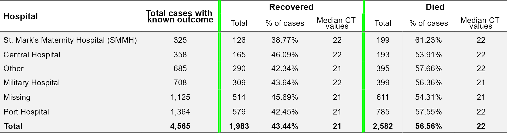
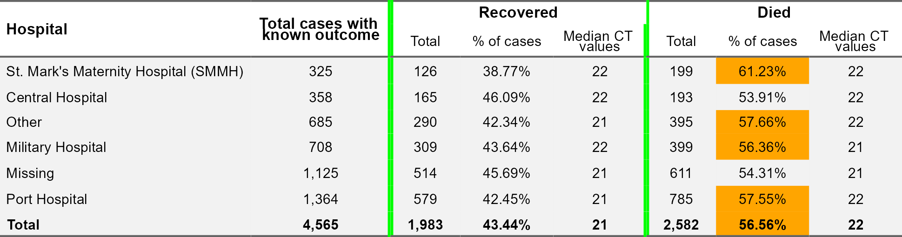
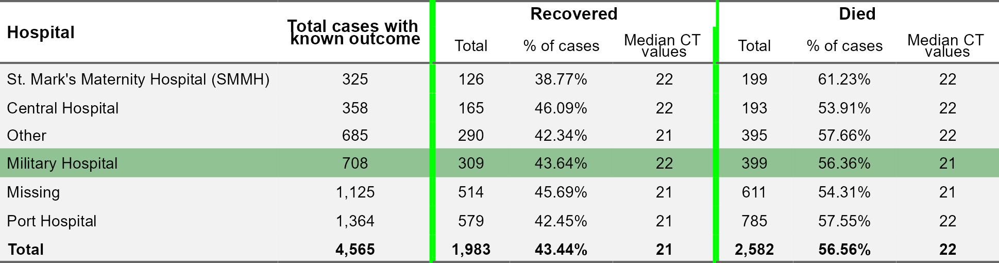

Tables for presentation
================

``` r
pacman::p_load(
        rio,            # import and export files
        here,           # locate files 
        tidyverse,      # data management and visualization
        flextable,      # make HTML tables 
        officer        # helper functions for tables
)
```

## Data preparation

### Import data

``` r
data <- rio::import(here("data/linelist_cleaned.rds"))
```

### Prepare table

``` r
# summarises patient outcomes and CT values by hospital, 
# with a Totals row at the bottom
(df_case <- data %>% 
        filter(!is.na(outcome)) %>% 
        group_by(hospital) %>%
        count(outcome) %>%
        pivot_wider(names_from = outcome,
                    values_from = n) %>%
        janitor::adorn_totals(where = "row") %>%
        mutate(known_cases = Death + Recover,
               pct_death = scales::percent(Death/known_cases,
                                           accuracy = 0.01),
               pct_recover = scales::percent(Recover/known_cases,
                                             accuracy = 0.01)) %>%
        rename(death_cases = Death,
               recover_cases = Recover))
```

    ##                              hospital death_cases recover_cases known_cases pct_death pct_recover
    ##                      Central Hospital         193           165         358    53.91%      46.09%
    ##                     Military Hospital         399           309         708    56.36%      43.64%
    ##                               Missing         611           514        1125    54.31%      45.69%
    ##                                 Other         395           290         685    57.66%      42.34%
    ##                         Port Hospital         785           579        1364    57.55%      42.45%
    ##  St. Mark's Maternity Hospital (SMMH)         199           126         325    61.23%      38.77%
    ##                                 Total        2582          1983        4565    56.56%      43.44%

``` r
(df_ct <- data %>%
        filter(!is.na(outcome)) %>%
        group_by(hospital, outcome) %>%
        summarise(median = median(ct_blood, na.rm = TRUE)) %>%
        pivot_wider(names_from = outcome,
                    values_from = median) %>%
        rename(ct_death = Death,
               ct_recover = Recover))
```

    ## `summarise()` has grouped output by 'hospital'. You can override using the `.groups` argument.

    ## # A tibble: 6 × 3
    ## # Groups:   hospital [6]
    ##   hospital                             ct_death ct_recover
    ##   <chr>                                   <dbl>      <dbl>
    ## 1 Central Hospital                           22         22
    ## 2 Military Hospital                          21         22
    ## 3 Missing                                    21         21
    ## 4 Other                                      22         21
    ## 5 Port Hospital                              22         21
    ## 6 St. Mark's Maternity Hospital (SMMH)       22         22

``` r
(df_ct_total <- data %>% 
        filter(!is.na(outcome)) %>%
        group_by(outcome) %>%
        summarise(ct_total = median(ct_blood, na.rm = TRUE)) %>%
        pivot_wider(names_from = outcome,
                    values_from = ct_total) %>%
        mutate(hospital = "Total") %>%
        select(hospital,
               ct_death = Death,
               ct_recover = Recover))
```

    ## # A tibble: 1 × 3
    ##   hospital ct_death ct_recover
    ##   <chr>       <dbl>      <dbl>
    ## 1 Total          22         21

``` r
(df_ct_value <- bind_rows(df_ct, df_ct_total))
```

    ## # A tibble: 7 × 3
    ## # Groups:   hospital [7]
    ##   hospital                             ct_death ct_recover
    ##   <chr>                                   <dbl>      <dbl>
    ## 1 Central Hospital                           22         22
    ## 2 Military Hospital                          21         22
    ## 3 Missing                                    21         21
    ## 4 Other                                      22         21
    ## 5 Port Hospital                              22         21
    ## 6 St. Mark's Maternity Hospital (SMMH)       22         22
    ## 7 Total                                      22         21

``` r
(table <- df_case %>% 
        full_join(df_ct_value) %>%
        select(hospital,
               known_cases,
               recover_cases, pct_recover, ct_recover,
               death_cases, pct_death, ct_death) %>% 
        # arrange rows from lowest to highest (Total row at bottom)
        arrange(known_cases))
```

    ## Joining with `by = join_by(hospital)`

    ##                              hospital known_cases recover_cases pct_recover ct_recover death_cases pct_death ct_death
    ##  St. Mark's Maternity Hospital (SMMH)         325           126      38.77%         22         199    61.23%       22
    ##                      Central Hospital         358           165      46.09%         22         193    53.91%       22
    ##                                 Other         685           290      42.34%         21         395    57.66%       22
    ##                     Military Hospital         708           309      43.64%         22         399    56.36%       21
    ##                               Missing        1125           514      45.69%         21         611    54.31%       21
    ##                         Port Hospital        1364           579      42.45%         21         785    57.55%       22
    ##                                 Total        4565          1983      43.44%         21        2582    56.56%       22

## Basic `flextable`

Create a flextable

``` r
flextable(table)
```


Column width

``` r
flextable(table) %>% autofit()
```


``` r
my_table <- flextable(table) %>%
        width(j = 1, width = 2.7) %>%
        width(j = 2, width = 1.5) %>%
        width(j = c(4, 5, 7, 8), width = 1)

my_table
```


Column headers

``` r
my_table <- my_table %>%
        add_header_row(
                # new header goes on top of existing header row
                top = TRUE,
                # header values for each column
                values = c("Hospital",
                           "Total cases with known outcome", 
                           "Recovered",    # top-level header for this and two next columns
                           "",             # empty value for merged column
                           "",
                           "Died",         # top-level header for this and two next columns
                           "",             # empty value for merged column
                           "")) %>% 
        # rename columns in original header row
        set_header_labels(
                hospital = "", 
                known_cases = "",
                recover_cases = "Total",
                pct_recover = "% of cases",
                ct_recover = "Median CT values",
                death_cases = "Total",
                pct_death = "% of cases",
                ct_death = "Median CT values") %>% 
        # horizontally merge columns 3 to 5 in new header row
        merge_at(i = 1, j = 3:5, part = "header") %>%
        # horizontally merge columns 6 to 8 in new header row
        merge_at(i = 1, j = 6:8, part = "header")

my_table
```


Borders & Background

``` r
# define style for border line
border_style <- officer::fp_border(color = "green", width = 2)

my_table <- my_table %>%
        # remove all existing borders
        border_remove() %>%  
        # add horizontal lines via a pre-determined theme setting
        theme_booktabs() %>% 
        # add vertical lines to separate Recovered and Died sections
        vline(part = "all", j = 2, border = border_style) %>%   # at column 2 
        vline(part = "all", j = 5, border = border_style)       # at column 5

my_table
```


Font & Alignment

``` r
my_table <- my_table %>% 
        flextable::align(align = "center", j = c(2:8), part = "all") %>%
        # adjust font size of header
        fontsize(i = 1, size = 12, part = "header") %>%
        # adjust bold face of header
        bold(i = 1, bold = TRUE, part = "header") %>%
        # adjust bold face of total row (row 7 of body)
        bold(i = 7, bold = TRUE, part = "body")

my_table
```


Merge cells

``` r
my_table <- my_table %>% 
        merge_at(i = 1:2, j = 1, part = "header") %>% 
        merge_at(i = 1:2, j = 2, part = "header")

my_table
```


Background colors

``` r
my_table <- my_table %>% 
        bg(part = "body", bg = "gray95")  

my_table 
```



Conditional formatting

``` r
my_table %>% 
        bg(j = 7,
           i = ~ pct_death >= 55,
           part = "body",
           bg = "orange") 
```



``` r
my_table %>% 
        bg(.,
           i= ~ hospital == "Military Hospital",
           part = "body",
           bg = "#91c293") 
```



``` r
# rmarkdown::render()
```
